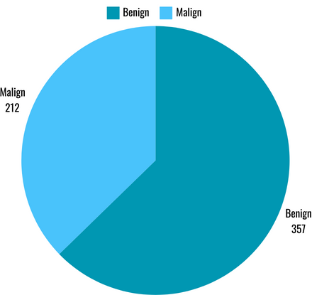
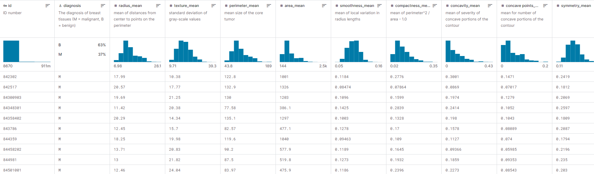
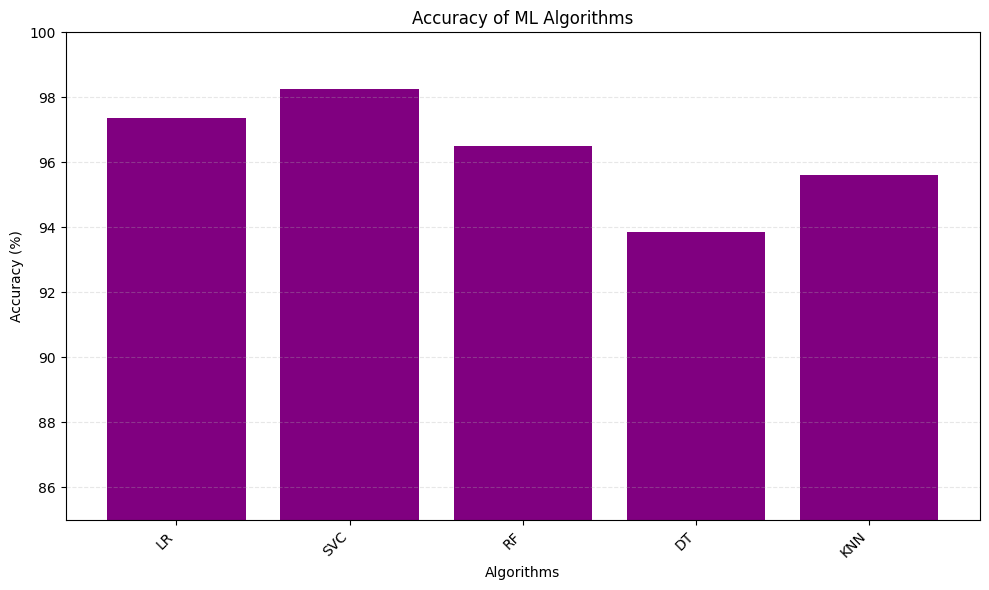
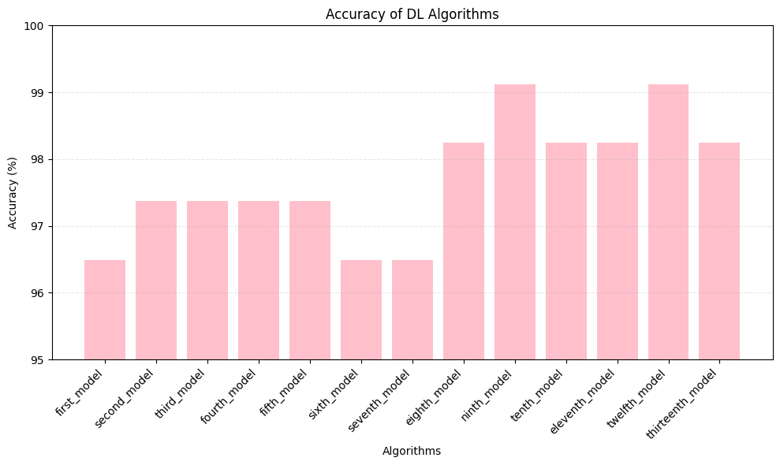
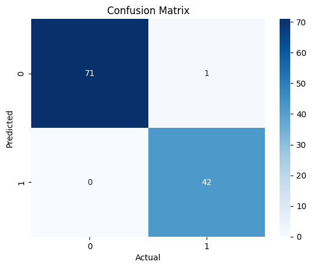
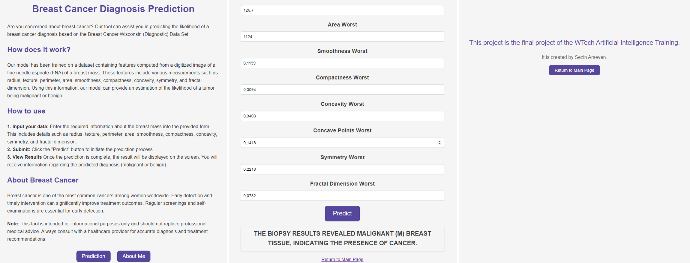
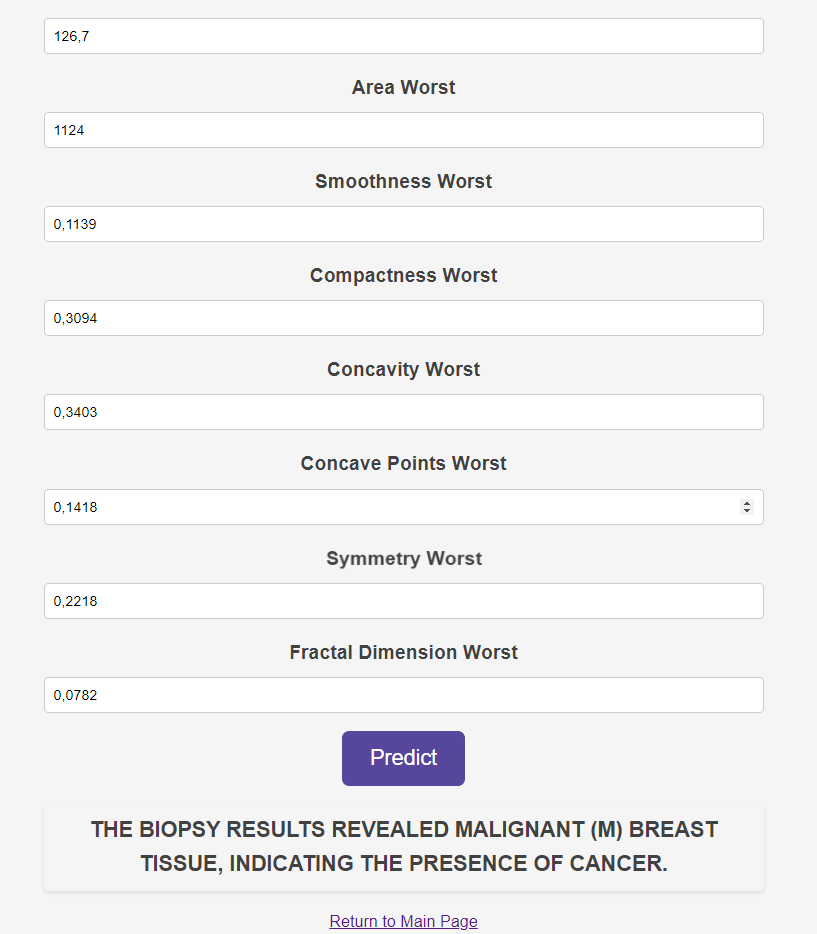
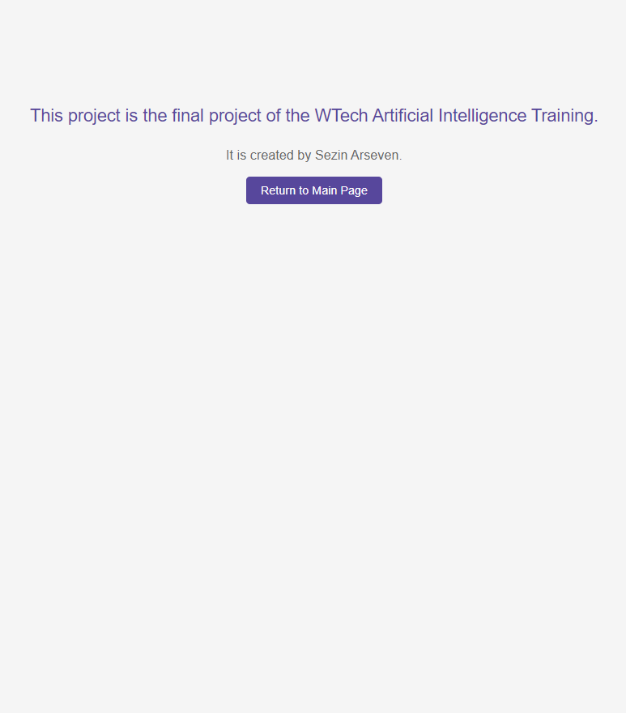

# Breast Cancer Diagnosis with Machine Learning and Deep Learning

This repository contains code for building machine learning and deep learning models to diagnose breast cancer using the Breast Cancer Wisconsin (Diagnostic) dataset. The dataset consists of features computed from a digitized image of a fine needle aspirate (FNA) of a breast mass, and the target variable indicates whether the mass is benign or malignant. Various machine learning algorithms such as Logistic Regression, Support Vector Machine, Random Forest, Decision Tree, and K-Nearest Neighbors are employed initially. Then, deep learning models using TensorFlow and Keras are constructed to further enhance the predictive performance. Hyperparameter tuning is conducted to optimize model accuracy. The final model is saved and evaluated for its performance metrics, including accuracy, sensitivity, and specificity.

## Dataset
</head>
<body>


<br><br><br><br><br>
<p align="center">
    The dataset used in this project is the <a href="https://www.kaggle.com/datasets/uciml/breast-cancer-wisconsin-data/data">Breast Cancer Wisconsin (Diagnostic) dataset</a>, which consists of features computed from a digitized image of a fine needle aspirate (FNA) of a breast mass. The target variable indicates whether the mass is benign (0) or malignant (1).
</p>

</body>
<br><br><br><br><br><br>



## Workflow
1. **Data Loading and Preprocessing:** The dataset is loaded, missing values are handled, categorical data is encoded, and the dataset is split into training and testing sets.
2. **Machine Learning Models:** Various machine learning models such as Logistic Regression, Support Vector Machine, Random Forest, Decision Tree, and K-Nearest Neighbors are trained.
3. **Deep Learning Models:** 13 deep learning models are constructed using TensorFlow and Keras, and parameters are optimized for improved performance.
4. **Model Evaluation:** The models are evaluated based on accuracy, sensitivity, and specificity.
5. **Model Saving and Loading:** The final model is saved for future use and loaded to make predictions.
6. **API Implementation** The FastAPI framework is utilized to implement an API endpoint (/predict) that accepts POST requests containing features of breast cancer samples. The data is processed, fed into the trained model, and predictions indicating whether the sample is benign or malignant are returned. Additionally, errors and exceptions are handled gracefully to ensure robustness.
7. **User Interface:** A web application has been created that allows users to interact with the breast cancer diagnosis model through a user-friendly interface. It consists of three main pages:
    - Main Page ([pages/mainpage.html](pages/mainpage.html)): This is the home page of the web application, providing an overview of the project.
    - About Me Page ([pages/aboutme.html](pages/aboutme.html)): This page provides information about the developer behind the project.
    - Prediction Page ([pages/prediction.html](pages/prediction.html)): On this page, users can input the required features (e.g., from an FNA image) and receive a prediction from the model regarding whether the breast mass is benign or malignant.

## Usage
1. Clone the repository:
```bash
git clone https://github.com/sezinarseven/Breast-Cancer-Diagnosis-with-Machine-Learning-and-Deep-Learning.git
cd Breast-Cancer-Diagnosis-with-Machine-Learning-and-Deep-Learning
```
2. Create a virtual environment:
```bash
python -m venv ysa_env
``` 
3. Activate the environment:
```bash
ysa_env\Scripts\activate
```
4. Update pip:
```bash
pip install --upgrade pip
# OR
python.exe -m pip install --upgrade pip
```
5. Install the required libraries in requirements.txt:
```bash
pip install -r requirements.txt
```

## Files
- `requirements.txt`: Lists the required Python libraries and their versions.
- `breast_cancer_diagnosis.ipynb`: Jupyter Notebook containing Python code for data loading, preprocessing, model training, evaluation, and saving/loading the final model.
- `README.md`: Overview of the project, instructions, and usage guide.
- `dataset\breastcancer.csv`: Dataset file containing the Breast Cancer Wisconsin (Diagnostic) dataset.
- `models\ysa_model.h5`: Saved model file for the final deep learning model trained for breast cancer diagnosis.
- `pages\mainpage.html`: Main page of the web application
- `pages\aboutme.html`: About me page of the web application
- `pages\prediction.html`: Prediction page of the web application
- `app.py`: FastAPI application file
- `api_implementation.py`: API implementation file

## Project Outcomes:

**1. Machine Learning Models Performance**
<body>



<p align="center">
<br><br><br><br><br><br>    
    <strong>- Logistic Regression:</strong> Achieved an accuracy of <strong>97.37%.</strong><br>
    <strong>- Support Vector Machine:</strong> Achieved an accuracy of <strong>98.25%.</strong><br>
    <strong>- Random Forest:</strong> Achieved an accuracy of <strong>96.49%.</strong><br>
    <strong>- Decision Tree:</strong> Achieved an accuracy of <strong>93.86%.</strong><br>
    <strong>- K-Nearest Neighbors:</strong> Achieved an accuracy of <strong>95.61%.</strong>
</p>
<br><br><br><br><br><br><br><br>
</body>

**2. Deep Learning Models Performance:**

<body>

<br><br>
<p align="center">
    <br><br><br><br><br><br>
   <strong>-</strong> Achieved an accuracy of <strong>99.12%.</strong><br>
   <strong>-</strong> Parameters were optimized to enhance the model's performance.
</p>
<br><br><br>
</body>

<br><br><br><br><br>

3. **Model Evaluation Metrics:**

</body>

<body>

<br><br>
<p align="center"><br><br><br><br><br><br><br><br>
   <b>- Accuracy:</b> 99.12%<br>
   <b>- Sensitivity (True Positive Rate):</b> 97.67%<br>
   <b>- Specificity (True Negative Rate):</b> 100%
</p>
</body>
<br><br><br><br><br><br><br><br><br><br><br><br><br><br>

4. **Model Saving and Loading:**
   - The final trained model was saved in the [`models\ysa_model.h5`](models\ysa_model.h5) file for future use.
   - The model can be loaded to make predictions without the need for retraining.

5. **Web Application:**<br>
The web application consists of three main pages:

    * **Main Page:** Provides an overview of the project, including its purpose, dataset used, workflow, and buttons to navigate to other pages.
    * **About Me Page:** Displays information about the creator of the project and the context of the project.
    * **Prediction Page:** Allows users to input various features related to breast cancer diagnosis. Upon submission, it sends the data to a backend API (http://127.0.0.1:8000/predict/) for prediction using the trained model and displays the prediction result on the page.

<div style="text-align: center;">
    
    
    
</div>

## Conclusion:

- The project successfully implemented both traditional machine learning algorithms and deep learning models for breast cancer diagnosis.
- Deep learning models showed superior performance compared to traditional machine learning algorithms, achieving an accuracy of 99.12%. Sensitivity and specificity were also considered to evaluate the models' performance comprehensively.
- The final trained model is integrated into a FastAPI application, making it accessible via API endpoints.
- A user-friendly web interface has been created for easy interaction with the breast cancer diagnosis system.

## Contributors
- [Sezin Arseven](https://github.com/sezinarseven)

Feel free to contribute to this project by forking the repository, making improvements, and submitting pull requests!